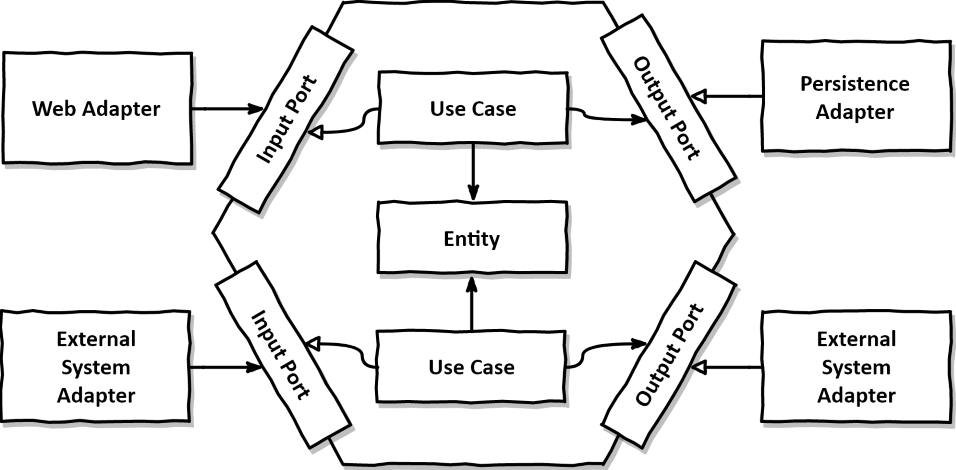
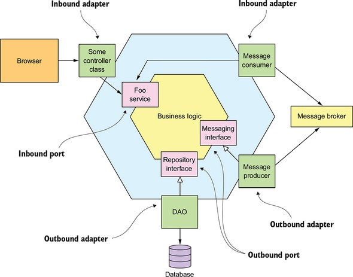

<div align="center">


</div>

<div align="center">

# POC Multi Modulos- Ports & Adapters Architecture ou Arquitetura Hexagonal


</div> 

<div align="center">

## Arquitetura



</div>

<div align="center">

## Sonar
[](https://sonarcloud.io/dashboard?id=wesleyosantos91_poc-multi-module-arch-hexagonal-springboot)

[](https://sonarcloud.io/dashboard?id=wesleyosantos91_poc-multi-module-arch-hexagonal-springboot)
[](https://sonarcloud.io/summary/new_code?id=wesleyosantos91_poc-multi-module-arch-hexagonal-springboot)
[](https://sonarcloud.io/dashboard?id=wesleyosantos91_poc-multi-module-arch-hexagonal-springboot)

[](https://sonarcloud.io/dashboard?id=wesleyosantos91_poc-multi-module-arch-hexagonal-springboot)
[](https://sonarcloud.io/dashboard?id=wesleyosantos91_poc-multi-module-arch-hexagonal-springboot)
[](https://sonarcloud.io/dashboard?id=wesleyosantos91_poc-multi-module-arch-hexagonal-springboot)

[](https://sonarcloud.io/dashboard?id=wesleyosantos91_poc-multi-module-arch-hexagonal-springboot)
[](https://sonarcloud.io/dashboard?id=wesleyosantos91_poc-multi-module-arch-hexagonal-springboot)
[](https://sonarcloud.io/dashboard?id=wesleyosantos91_poc-multi-module-arch-hexagonal-springboot)
[](https://sonarcloud.io/dashboard?id=wesleyosantos91_poc-multi-module-arch-hexagonal-springboot)

</div>

## Fundamentos teóricos

> Ports & Adapters Architecture ou Arquitetura Hexagonal: A arquitetura hexagonal, ou arquitetura de portas e adaptadores, é um padrão arquitetural usado no design de software. O objetivo é criar componentes de aplicativos fracamente acoplados que possam ser facilmente conectados ao ambiente de software por meio de portas e adaptadores.

##  Pré -requisitos

- [ `Java 11+` ](https://www.oracle.com/java/technologies/downloads/#java11)
- [ `Docker` ](https://www.docker.com/)
- [ `Docker-Compose` ](https://docs.docker.com/compose/install/)

## Stack
- **Sonar** Analise de qualidade e cobertura de testes
- **Elasticsearch** Busca e análise de dados
- **Logstash** Pipeline de dados
- **Kibana** Visualização de dados
- **Filebeat** Log shipper
- **Prometheus** Monitoramento e alertas
- **Grafana** Análise e Monitoramento
- **Jaeger** Tracing Distribuído

## Portas
| Aplicação          | Porta  |
|--------------------|--------|
| Ms-Launcher        | 8080   |
| Sonarqube          | 9000   |
| Postgres Sonarqube | 5432   |
| Elasticsearch      | 9200   |
| Logstash           | 5044   |
| Kibana             | 5601   |
| Prometheus         | 9090   |
| Grafana            | 3000   |
| Jaeger             | 16686  |


## Links

- Sonar Cloud
  - http://localhost:9000
- Kibana 
  - http://localhost:5601
- Prometheus
  - http://localhost:9090
- Grafana
  - http://localhost:3000
- Jaeger
  - http://localhost:16686
- OpenAPI 
  - Swagger
    - http://localhost:8080/swagger-ui/index.html
  - API Docs
    - http://localhost:8080/v3/api-docs
## Setup

- ### Variáveis de ambiente

| Variável de Ambiente  | Descrição                                                                      |
|-----------------------|--------------------------------------------------------------------------------|
| `MYSQL_HOST`          | Especifique o host do banco de dados `MySQL` a ser usado (padrão `localhost` ) |
| `MYSQL_PORT`          | Especifique a porta do banco de dados `MySQL` a ser usada (padrão `3306` )     |
| `JAEGER_HOST`         | Especifique o host do `Jaeger` a ser usado (padrão `localhost` )               |
| `JAEGER_PORT`         | Especifique a porta do `Jaeger` a ser usada (padrão `6831` )                   |

### Start da aplicação via script
- Entre no diretorio dos scripts `cd scripts`
- Execute o seguinte comando: 
  ```
  /bin/bash start-app.sh
  ```

### Executando a aplicação com maven
- Execute o seguinte comando:
  ```
  ./mvnw clean spring-boot:run --projects ms-launcher
  ```
  > **Nota:** Se você quiser mudar para "non-json-logs" (talvez durante o desenvolvimento seja útil), execute
  > ```
  > ./mvnw clean spring-boot:run --projects ms-launcher -Dspring-boot.run.jvmArguments="-Dspring.profiles.active=non-json-logs"
  > ```

### Executar docker-compose para subir aplicação com container docker
- Execute o seguinte comando para subir os containers: 
  ```
  docker-compose up
  ```
- Execute o seguinte comando para verificar os status do containers docker:
  ```
  docker-compose ps
  ```
  
### Sonarqube

- Realize o Login com user: admin password: admin para uma nova senha
- Clique na opção Manually
- Crie os Project display name/project key: `poc-multi-module-arch-hexagonal-springboot`
- Clique na opção Locally
- Preencha com `wos` e clique em Generate
- Subtitua o project key e token do arquivo `scripts/sonar.sh` pelos criado agora
- Entre no diretorio dos scripts `cd scripts`
- Execute o seguinte comando: 
  ```
  /bin/bash sonar.sh
  ```

### Kibana

- Na página principal, clique no ícone do menu *"hambúrguer"* e, em seguida, clique em `Discover`
- Clique no botão `Create index pattern`
- No campo `Name`, defina `filebeat-*`
- No campo `Timestamp field` selecione `@timestamp`
- Clique no botão `Create index pattern`
- Clique no ícone do menu "hambúrguer"Discover novamente e depois clique para iniciar as pesquisas

### Prometheus
- Na Páginal Principal, é possivel consultar metricas disponível no recuso `http://localhost:8080/actuator/prometheus`
- Exemplo: pesquise por `http_server_requests_seconds_sum` vai retorna as metricas/grafico (clicando na aba graph)
- No Menu superior selecione a opção Status -> Targets para vizualizar o status do serviço configurado

## Deletar todos containers Docker

- Entre no diretorio dos scripts `cd scripts`
- Execute o seguinte comando:
  ```
  /bin/bash remove-docker-images.sh
  ```

## TODO List

- [x] Qualidade de código
  - [x] Sonarqube
- [ ] Observabilidade
  - [x] Logs ELK (Elasticsearch, Logstash, Kibana) e Filebeat
  - [ ] Prometheus e Grafana
  - [x] Jaeger distributed tracing
